### 摘要

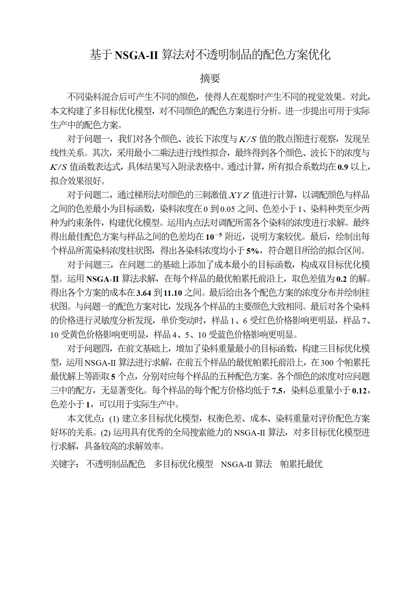

### 问题二图片

**染料配比**
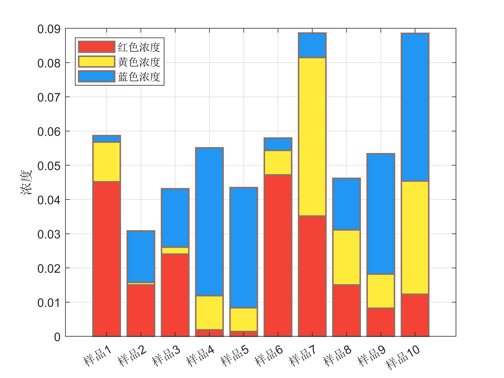

**颜色残差图**
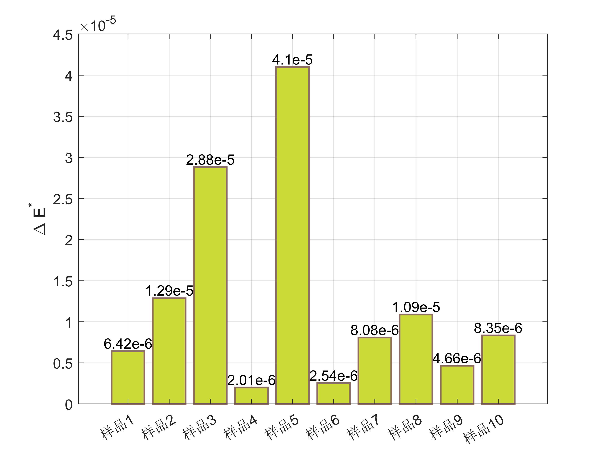

### 问题三图片

**优化帕累托前沿**
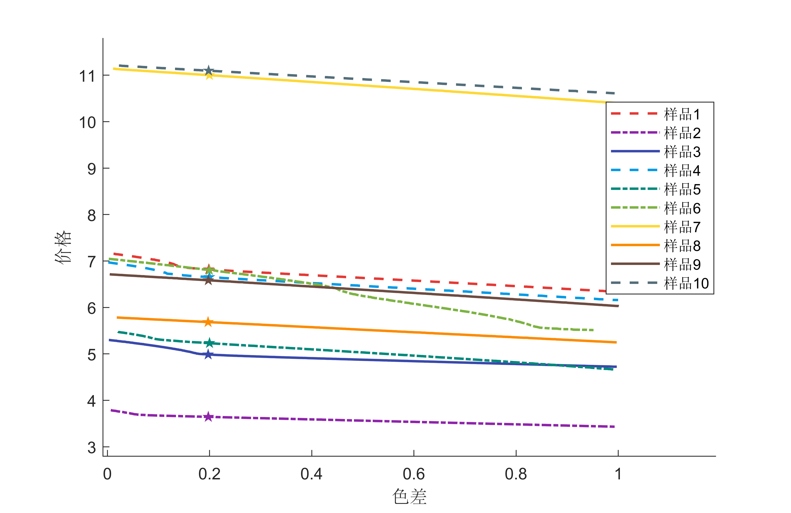

**染料浓度**
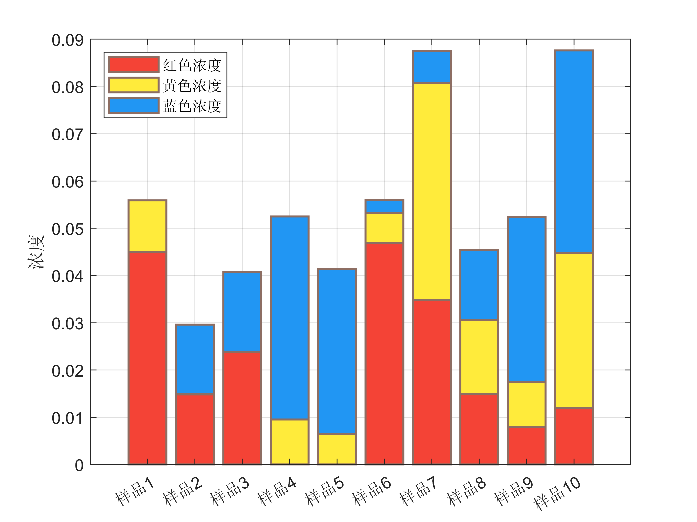

**染料总价格**
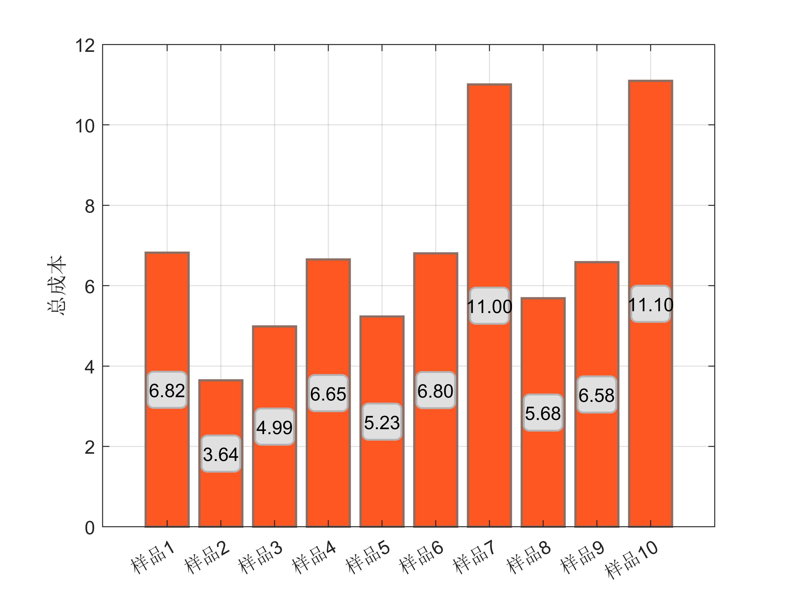

**红色价格变动热力图**
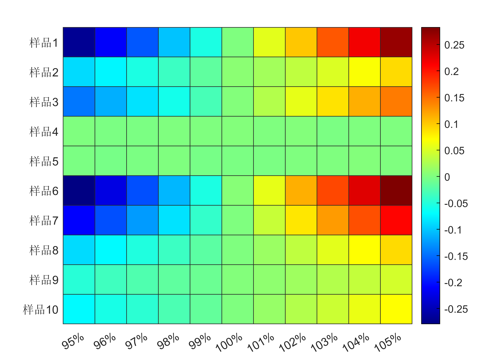
**蓝色价格变动热力图**
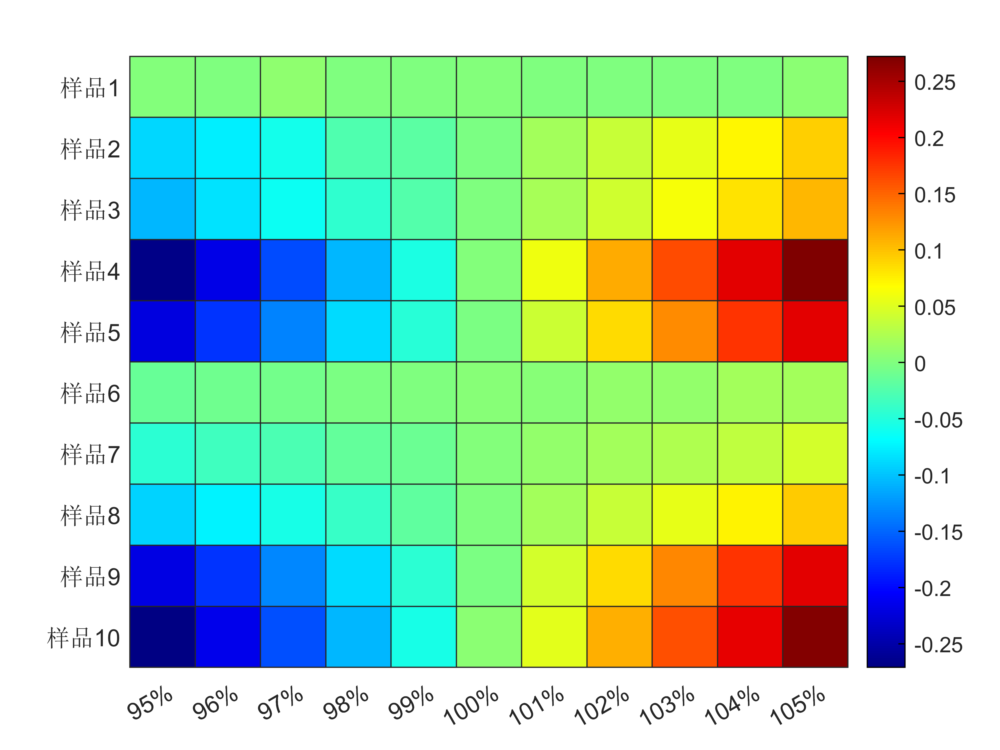
**黄色价格变动热力图**
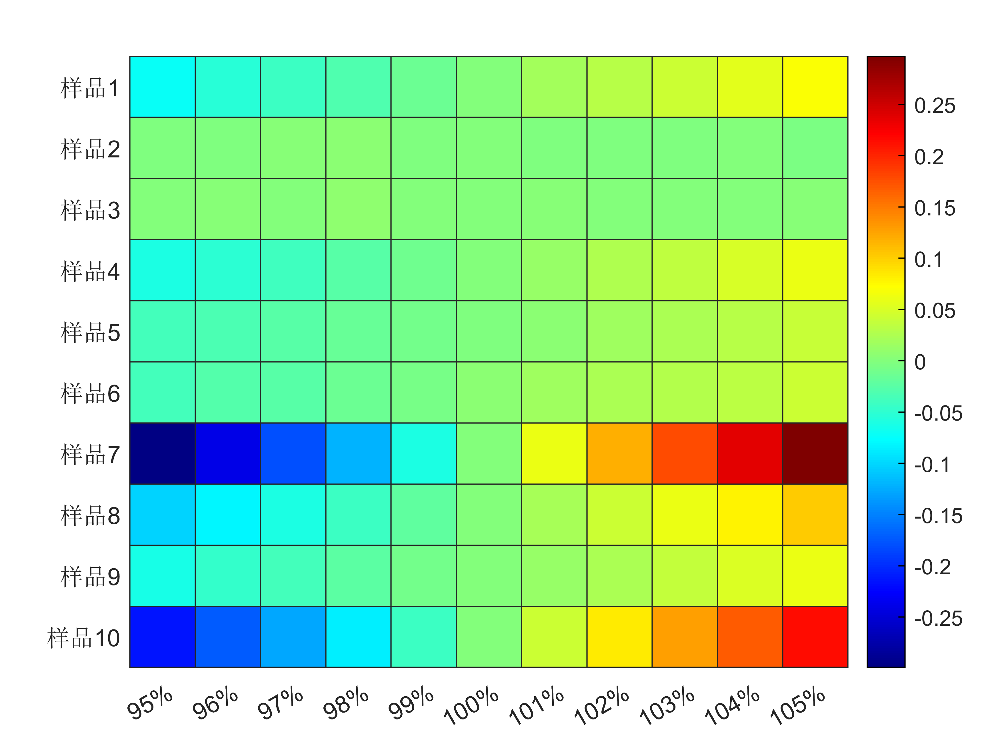

### 问题四图片

**每种样品在帕累托前沿中选出(等距选取)的5个不同的配方**
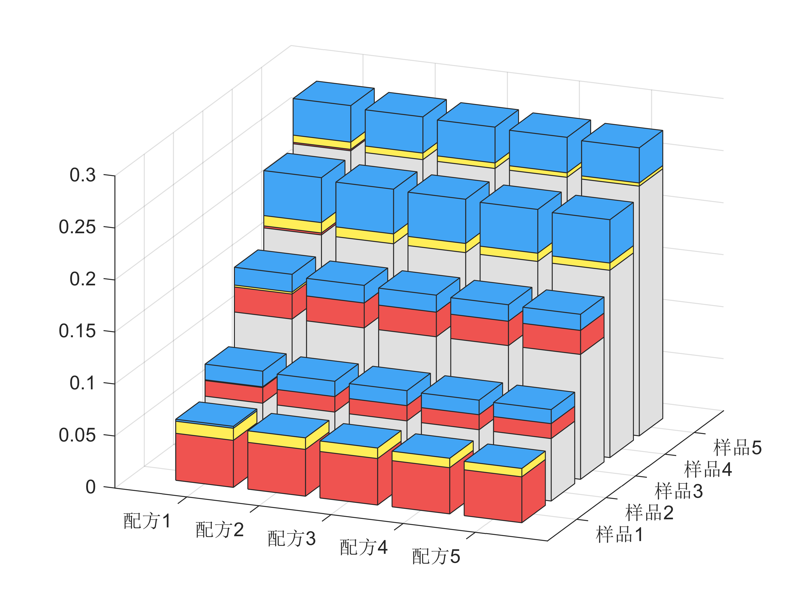

**帕累托前沿**
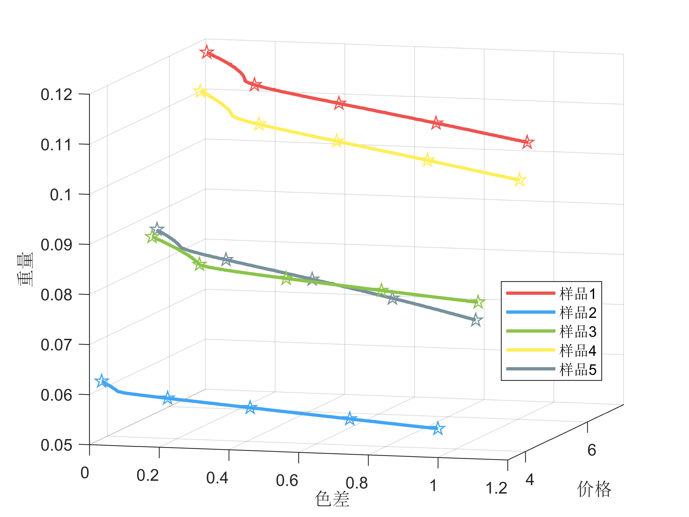

**每种配方的价格**
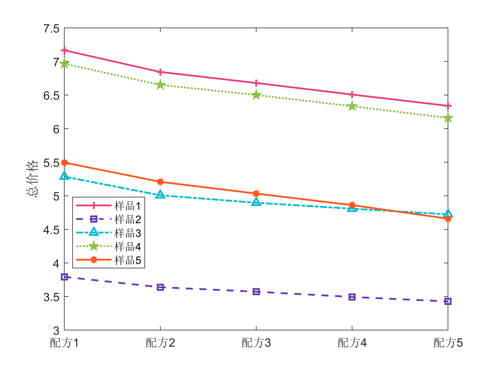

**每种配方的重量**

**每种配方的色差**
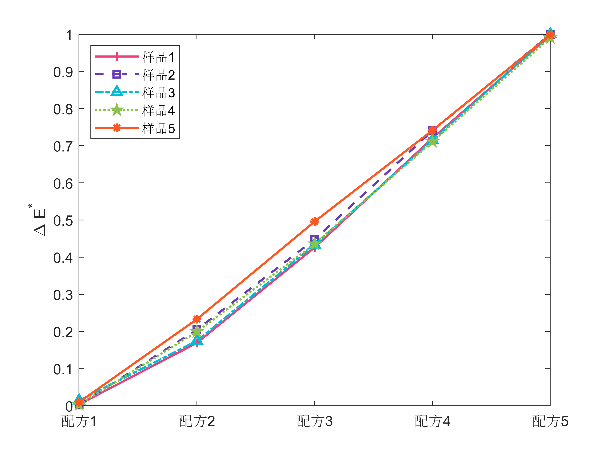