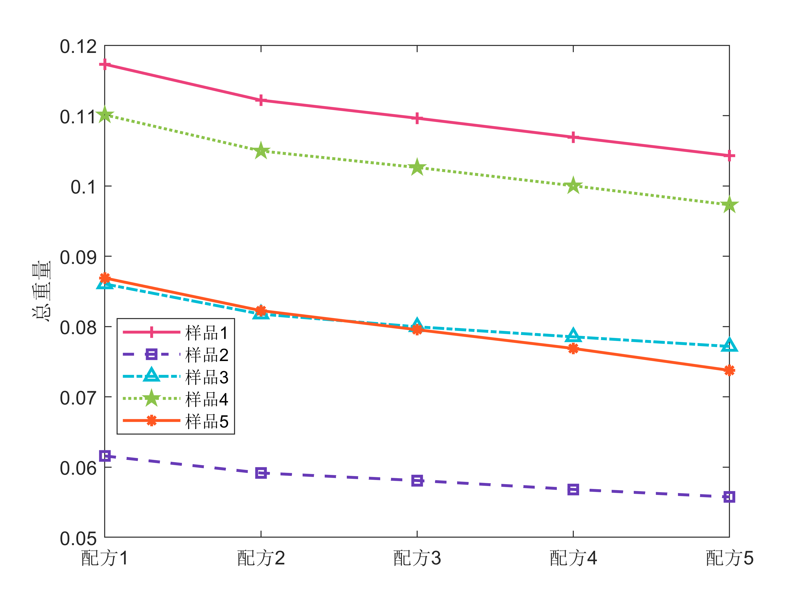

### 摘要

### 问题二图片

**染料配比**

**颜色残差图**

### 问题三图片

**优化帕累托前沿**

**染料浓度**

**染料总价格**

**红色价格变动热力图**

**蓝色价格变动热力图**

**黄色价格变动热力图**

### 问题四图片

**每种样品在帕累托前沿中选出(等距选取)的5个不同的配方**

**帕累托前沿**

**每种配方的价格**

**每种配方的重量**

**每种配方的色差**
