### 摘要

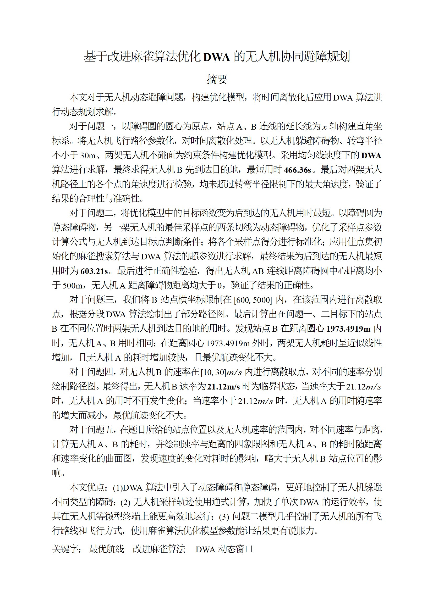

图片太多，仅展示部分图片

### 问题一图片

**飞行轨迹图**
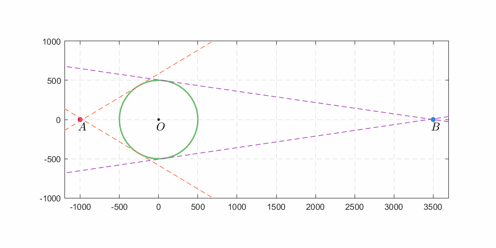

**无人机到静态障碍物距离**
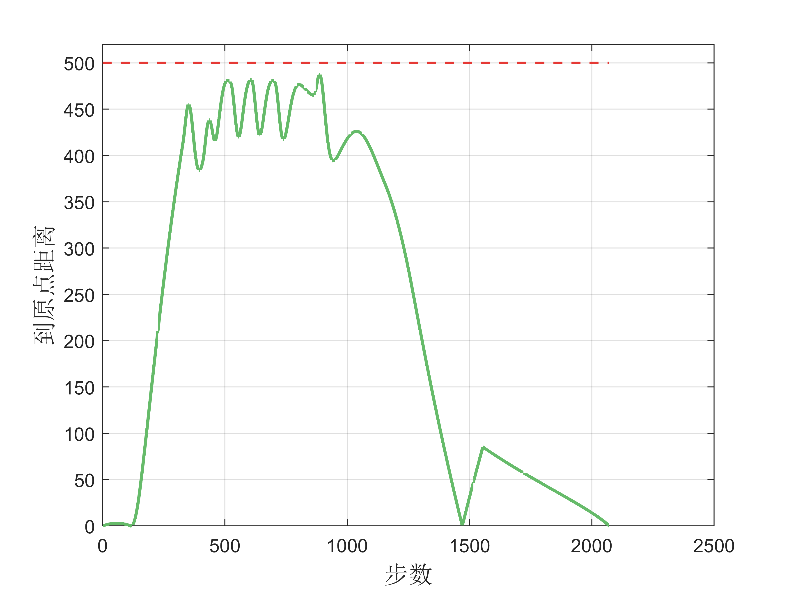

**无人机飞行过程中各项指标**
.png)

**无人机飞行过程中角速度**
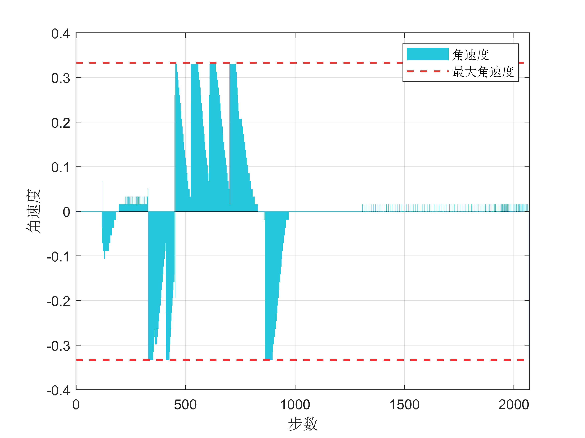

### 问题二图片

**最优解动图**
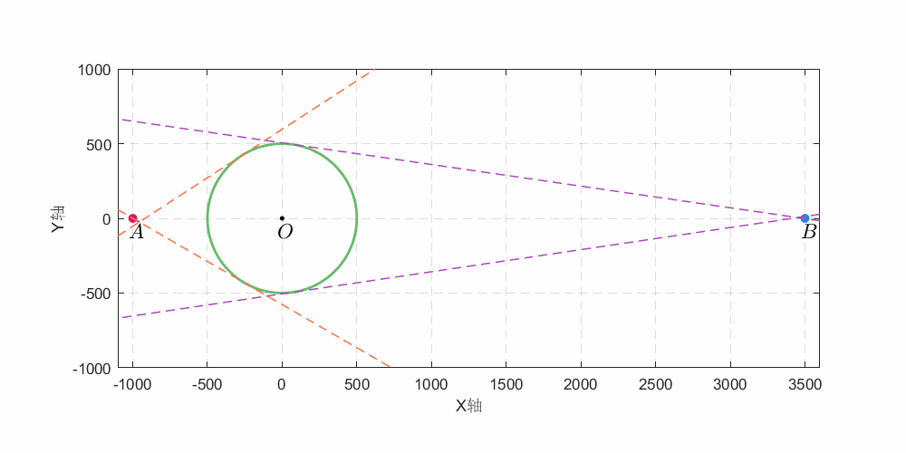

**麻雀算法迭代线路、耗时图**
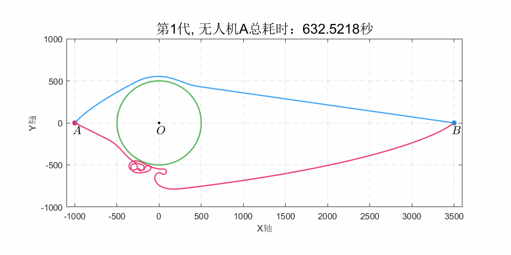

**A到静态障碍物距离**
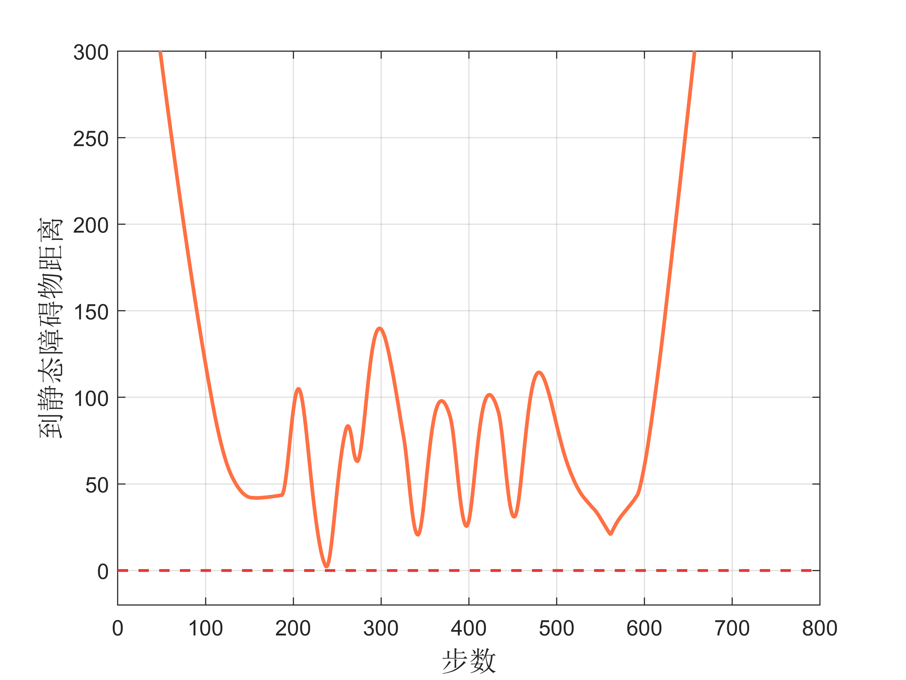

**AB连线到静态障碍物距离**
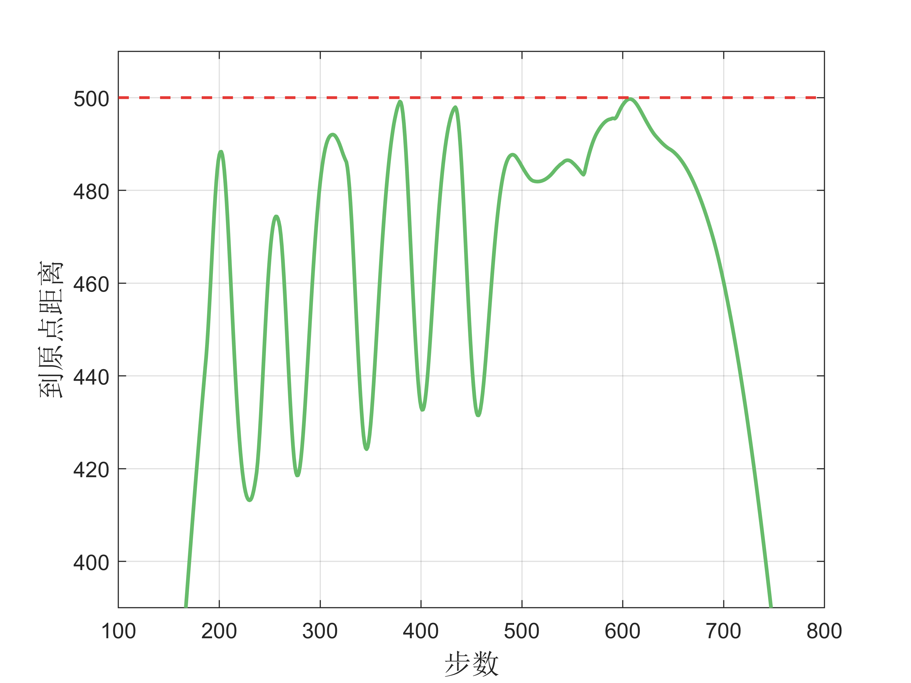

### 问题三图片

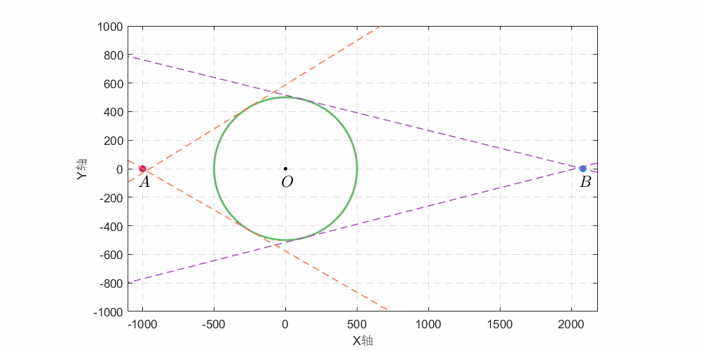

### 问题四图片

**q4无人机速度-耗时曲线**
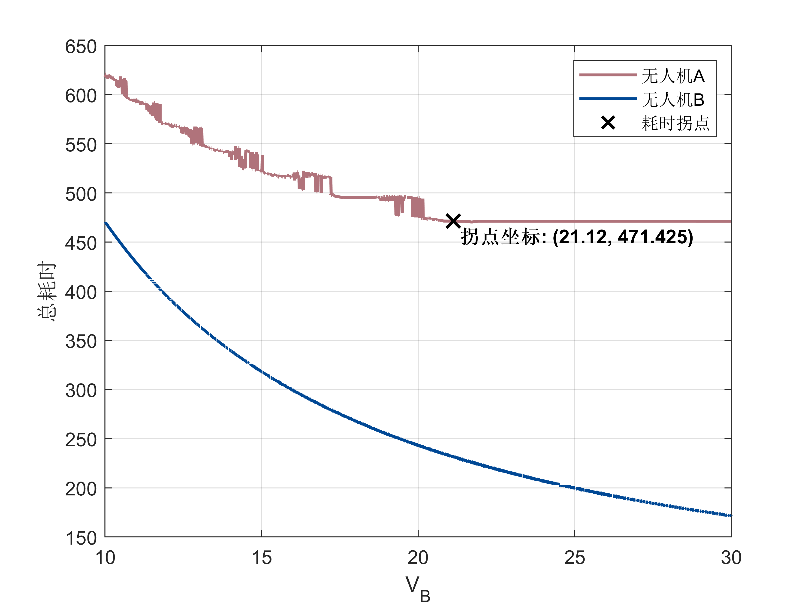

### 问题五图片

**无人机A耗时曲面**
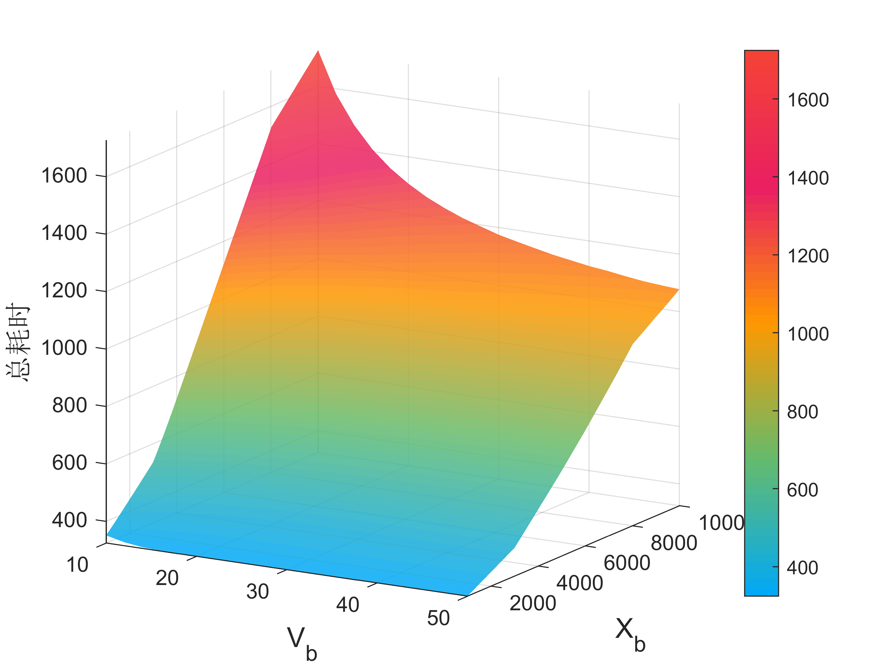

**q5无人机B耗时曲面**
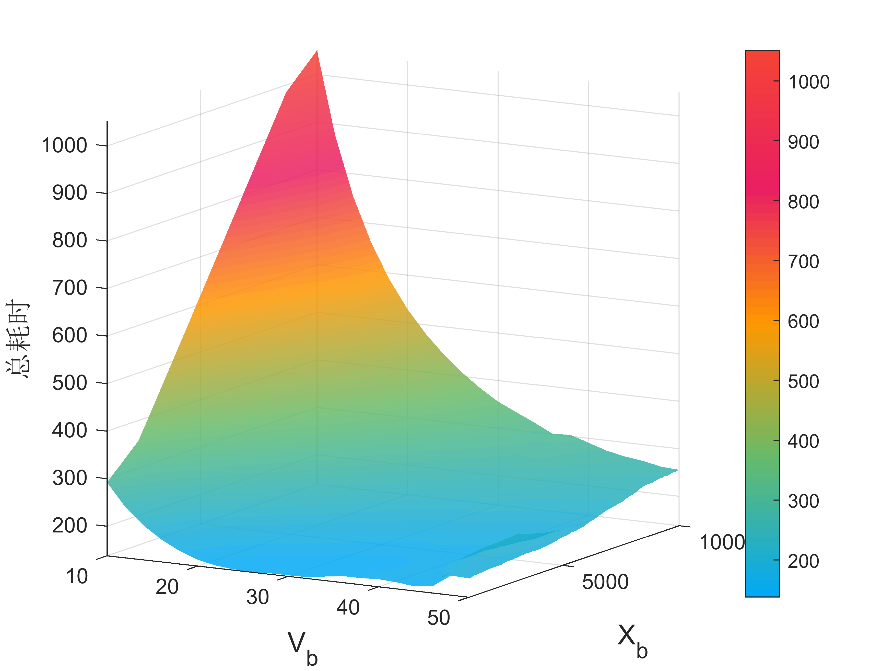
