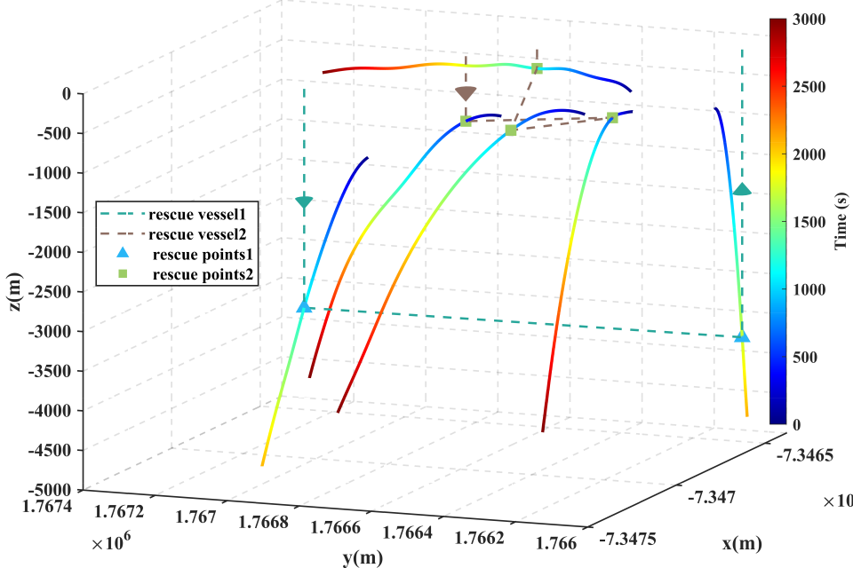

### 摘要

### 问题一图片

**密度洋流0m**

**密度洋流1000m**

**注水下潜**

**悬浮漂浮**

**沉底悬浮三维图**

**灵敏度**

### 问题三图片

**时空热力图**

**Parzen窗法灵敏度分析**

**窗大小=1300**

**窗大小=2800**

**窗大小=4000**

### 问题四图片

**救援路线**

**优化曲线**

